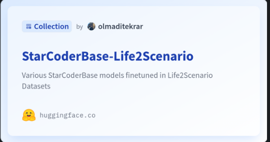

# Life2Scenario: Can LLMs modify AV scenario following prompts?

## Overview
In Automated Vehicle (AV) simulations, XML files are used to replicate real-world environments. These
files often require developers to frequently update scenario descriptions or rely on deterministic automation
tools. Our project aims to streamline modifications to these files by allowing changes through text prompts,
bypassing direct XML manipulation, and making the process more efficient and user-friendly.

## Project Structure
- `model/`: Contains the scripts to fine-tune the model `starcoder` on the `Life2Scenario` task
- `dataset_generation/`: Contains the scripts to generate the dataset for the `Life2Scenario` task

# Dataset Generation
CARLA simulator(Unreal Engine) is used to generate the dataset. The dataset is generated by running the CARLA simulator and recording the scenario descriptions and the corresponding XML files. The dataset is then preprocessed to be used as training data for the model. Original scenario executor is `scenario_runner` package from CARLA community: [CARLA #ScenarioRunner](https://github.com/carla-simulator/scenario_runner)

There are three main components of the dataset generation module:
1. `dataset_generator.py`: Responsible for managing CARLA API and Simulator with the dataset generation modules.
   1. Main entry point
   2. Responsible for finding out which scenario is currently running and which scenario should be created next.
   3. Responsible for triggering `scenario_extender` and `scenario_manipulator` classes to generate the dataset wrt the current scenario.
2. `scene_manipulator.py`: Responsible for manipulating the scenario within the context of CARLA simulator
   1. Responsible for maintaining requested actions and executing them in the simulator
3. `scenario_extender.py`: Responsible for extending the scenario description with the new actions
   1. Responsible for maintaining the scenario description and extending it with the new actions
   2. Uses the actions from the `scene_manipulator` to extend the scenario description files, `.xosc`.
   3. Responsible for saving the extended scenario description files, `.xosc`, with `prompts`, forming the dataset

## Main Libraries Used
- `carla`: Python API for CARLA simulator
- `scenario_runner`: Scenario runner package from CARLA community

## Dataset Generation Steps
1. Install CARLA simulator:
   1. Version 0.9.15 is used for the dataset generation. 
      1. Refer to [Carla #Package Installation](https://carla.readthedocs.io/en/latest/start_quickstart/#carla-installation)
   2. Alternatively, you can install the binary from the releases:
      1. _Note that we used precompiled binaries for CARLA simulator for Linux_
      2. [Carla #Releases 0.9.15](https://github.com/carla-simulator/carla/releases/tag/0.9.15)
2. Install the Python API for CARLA:
   1. Refer to [Carla #Install client library](https://carla.readthedocs.io/en/latest/start_quickstart/#carla-installation)
   2. `pip3 install carla`
3. Find a base scenario, for example, `LaneChangeSimple`
   1. Run the `scenario_runner` package with the base scenario:
      1. `python3 ${SCENARIO_RUNNER_ROOT}/scenario_runner.py  --openscenario ${SCENARIO_RUNNER_ROOT}/srunner/examples/LaneChangeSimple.xosc`
4. Run the `dataset_generator` to generate the dataset:
   1. `python3 dataset_generator.py`
5. Output dataset will be saved in the `dataset_generation/dataset` directory:
   1. `dataset_generation/dataset/`:
      1. `prompts/`: Contains the prompts, `.txt`
      2. `ref_scenarios/`: Contains the reference scenario descriptions, `.xosc`
      3. `target_scenarios/`: Contains the target scenario descriptions, `.xosc`

# Fine-tuning the Model
The `bigcode/starcoderbase-1b` model is fine-tuned on the `Life2Scenario-minimal` dataset with the `transformers` library. 

- Codebase forked for starcoder: [starcoder](https://github.com/bigcode-project/starcoder)
- Original models: 
  - Model Link: [bigcode/starcoderbase-1b](https://huggingface.co/bigcode/starcoderbase-1b)
  - Model Link: [bigcode/starcoderbase-3b](https://huggingface.co/bigcode/starcoderbase-3b)

## Collection

## Model Regisry
| Model Name | Model Link | Dataset Name | Dataset Link |
|------------|------------|--------------|--------------|
| `starcoderbase_3b_life2scenario_medium_60ep` | [starcoderbase_3b_life2scenario_medium_60ep](https://huggingface.co/life2scenario-llm24/starcoderbase_3b_life2scenario_medium_60ep) | `Life2Scenario-medium` | [Life2Scenario-medium](https://huggingface.co/datasets/life2scenario-llm24/Life2Scenario-medium) |
| `starcoderbase_1b_life2scenario_minimal_210ep` | [starcoderbase_1b_life2scenario_minimal_210ep](https://huggingface.co/life2scenario-llm24/starcoderbase_1b_life2scenario_minimal_210ep) | `Life2Scenario-minimal` | [Life2Scenario-minimal](https://huggingface.co/datasets/life2scenario-llm24/Life2Scenario-minimal) |
| `starcoderbase_1b_life2scenario_medium_300ep` | [starcoderbase_1b_life2scenario_medium_300ep](https://huggingface.co/life2scenario-llm24/starcoderbase_1b_life2scenario_medium_300ep) | `Life2Scenario-medium` | [Life2Scenario-medium](https://huggingface.co/datasets/life2scenario-llm24/Life2Scenario-medium) |

## Main Libraries Used
- `transformers`: Huggingface library for fine-tuning the model
- `torch`: PyTorch library for fine-tuning the model
- `datasets`: Huggingface library for handling the dataset
- `peft`: Parameter-Efficient Fine-Tuning (PEFT) 
- `bitsandbytes`: Lightweight Python wrapper around CUDA custom functions
- `accelerate`: PyTorch library for distributed training, on top of `torch.distributed`

# Project Members
- Onur Can Yucedag
- Mk Bashar 
- Samia Islam